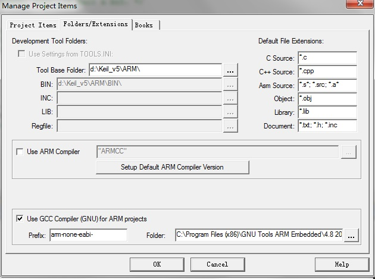
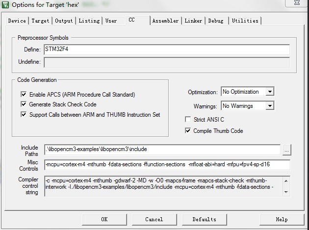
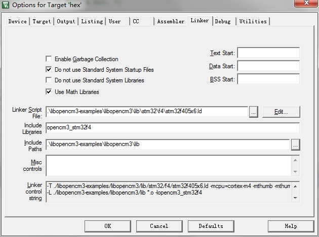

# 为什么要使用keil mdk编译stm32的代码？
很多参考代码都采用gcc编译，如chibios, libopencm3，但是如果调试是一个大问题，特别是使用eclipse+jlink的情况下。网络上有很多教程，但是实际使用时都很麻烦。但是keil MDK和jlink这种调试器配合使用时很方便。

# 准备工作
 - 下载所需软件
  - arm-gcc https://launchpadlibrarian.net/177524958/gcc-arm-none-eabi-4_8-2014q2-20140609-win32.exe
  - keil MDK5.必须是5.x版本，否则gcc编译时会报无法识别”-Wl“这个选项的错误。
  - 安装keil mdk支持包，如https://keilpack.azureedge.net/pack/Keil.STM32F4xx_DFP.2.11.0.pack
 - 基本配置
  - 
  - 指定库路径，如libopencm3，并增加编译选项
  - 
```
-mcpu=cortex-m4 -mthumb -fdata-sections -ffunction-sections  -mfloat-abi=hard -mfpu=fpv4-sp-d16
#针对有hardware float的cotex-m4 mcu
```
  - 

# 建立工程并编写代码
- 如果采用libopencm给的ld文件，则不需要自定义启动脚本。

- 参考代码如下：
```C
#include <libopencm3/stm32/rcc.h>
#include <libopencm3/stm32/gpio.h>

static void gpio_setup(void)
{
	/* Enable GPIOD clock. */
	/* Manually: */
	// RCC_AHB1ENR |= RCC_AHB1ENR_IOPDEN;
	/* Using API functions: */
	rcc_periph_clock_enable(RCC_GPIOC);

	/* Using API functions: */
	gpio_mode_setup(GPIOC, GPIO_MODE_OUTPUT, GPIO_PUPD_NONE, GPIO3);
}

int main(void)
{
	int i;

	gpio_setup();

	/* Blink the LED (PC8) on the board. */
	while (1) {

		/* Using API function gpio_toggle(): */
		gpio_toggle(GPIOC, GPIO3);	/* LED on/off */
		for (i = 0; i < 1000000; i++) {	/* Wait a bit. */
			__asm__("nop");
		}
	}

	return 0;
}
```

